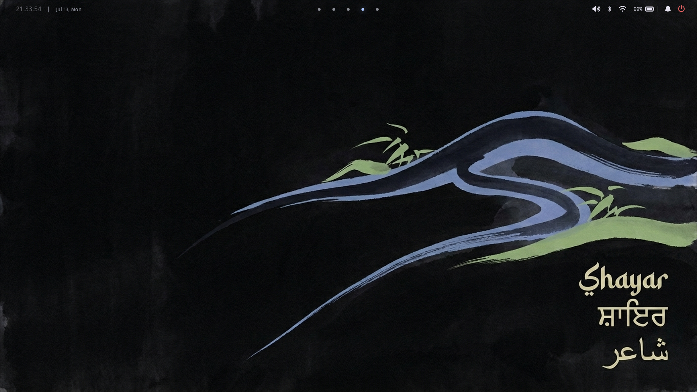

# Shayar

> **Shayar** (Urdu: شاعر, meaning *poet*)

A Hyprland rice built on one idea: pick a wallpaper, and the entire desktop adapts. Colors, borders, shadows, animations — everything pulls from a single palette generated on the fly. No hardcoded values. No manual theming. Just wallpaper-driven cohesion.

Built on the modular foundation of [ML4W Dotfiles](https://github.com/mylinuxforwork/dotfiles) by Stephan Raabe. GPL-3.0.

---

## What you get

- **Wallpaper-driven theming** — one wallpaper change recolors terminal, bar, launcher, lock screen, notifications, and applets
- **Single source of truth** — `design-tokens.json` (304 tokens) drives every visual value
- **Solid applet UI** — clean, opaque panels with matugen colors, borders, and shadows
- **Quickshell applets** — native QML power menu, calendar, WiFi, Bluetooth, volume, and welcome panels
- **Zero `~/.config` pollution** — everything symlinks from this repo

---

## Screenshots

<p align="center">
  
</p>

---

## Install

```bash
git clone https://github.com/VardanRattan/shayar.git ~/shayar
cd ~/shayar
./scripts/link.sh
```

> [!IMPORTANT]
> **Never copy files manually.** The architecture uses symlinks — edits in the repo apply instantly, and `git pull` updates your desktop.

### Requirements

| Dependency | Role |
|:--|:--|
| Hyprland | Window manager |
| awww-daemon | Wallpaper setter |
| matugen | Material You color generator |
| quickshell | Qt6 applet host |
| fzf, jq, gum | CLI tools |
| grim, slurp, wl-copy | Screenshots |

### Distro support

| Distro | Status |
|:--|:--|
| Arch (EndeavourOS, Garuda) | Native — automated install |
| Fedora | Community — manual matugen/quickshell build |
| Ubuntu/Debian | Unsupported (packages too old) |

---

## Architecture

```
wallpaper
  → awww-daemon (sets image)
  → matugen (extracts palette)
  → design-tokens.json (single source of truth)
  → per-component colors.* files
  → all configs pick up new colors
  → UI reloads instantly
```

| Path | Component |
|:--|:--|
| `hypr/` | Hyprland — Lua modular config, animations, keybinds |
| `waybar/` | Status bar — semi-transparent pill theme, token-resolved CSS |
| `rofi/` | App launcher — 5 config modes |
| `swaync/` | Notification center — solid theme, DND toggle |
| `kitty/` | Terminal — matugen colors, truecolor |
| `quickshell/` | Applets — power, calendar, WiFi, BT, volume, welcome (QML) |
| `shayar/` | Core — scripts, bin tools, design tokens, settings |
| `bashrc/`, `zshrc/` | Shell configs — shared aliases |

---

## Keybinds

| Key | Action | Key | Action |
|:--|:--|:--|:--|
| `SUPER+Return` | Terminal | `SUPER+CTRL+Return` | App launcher |
| `SUPER+B` | Browser | `SUPER+CTRL+W` | Wallpaper picker |
| `SUPER+E` | File manager | `SUPER+V` | Clipboard history |
| `SUPER+Q` | Kill window | `SUPER+PRINT` | Screenshot |
| `SUPER+F` | Fullscreen | `ALT+SPACE` | Settings menu |
| `SUPER+T` | Float toggle | `SUPER+SHIFT+L` | Lock screen |
| `SUPER+J` | Split toggle | `SUPER+CTRL+L` | Power menu |
| `SUPER+1-0` | Workspace | `SUPER+CTRL+N` | Network applet |
| `SUPER+SHIFT+1-0` | Move to workspace | `SUPER+CTRL+B` | Bluetooth applet |
| `SUPER+S` | Special workspace | `SUPER+SHIFT+B` | Toggle statusbar |
| `SUPER+CTRL+H` | Welcome screen | | |

Full list: [default.lua](config/hypr/conf/keybindings/default.lua)

---

## Shell aliases

| Alias | Command |
|:--|:--|
| `apps` | Fuzzy app drawer |
| `wallpaper` | Terminal wallpaper picker |
| `screenshot` | Interactive screenshot tool |
| `quick` | Custom command bookmarks |
| `wifi` | NetworkManager TUI |
| `updates` | System update (pacman + flatpak) |
| `lock` | Lock screen |

---

## Updating

```bash
cd ~/shayar && git pull && ./scripts/link.sh
```

Symlinks mean local edits survive pulls. Git conflicts are the only thing that overwrites your changes.

---

## License

GPL-3.0 — inherited from [ML4W Dotfiles](https://github.com/mylinuxforwork/dotfiles).
